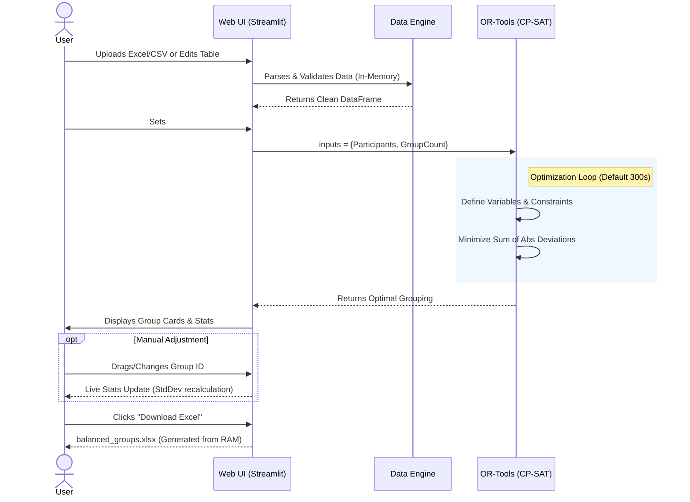

# ⚖️ Group Balancer

[](https://group-balancer.streamlit.app/)
[](LICENSE)
[](https://www.python.org/downloads/)

A powerful, mathematical team generation tool built with **Streamlit** and **Google OR-Tools**.

This application solves the "fair partition" problem by ensuring:
1. **Skill Balance:** Minimizes the difference in average scores between groups.
2. **Expert Distribution:** "Star" players (e.g., leaders/experts) are spread evenly across teams.
3. **Interactive Control:** Users can manually tweak assignments after generation with live statistical feedback.

---

## 🛡️ Data Privacy & Security

This application is designed to be **stateless and secure**:
* **No Persistent Storage:** When using the Web UI, uploaded files and generated results exist **only in memory (RAM)** during your active session. They are *not* saved to the server's hard drive or a database.
* **Session Isolation:** Each user's data is isolated via Streamlit's session state mechanism. Concurrent users cannot see or access each other's data.
* **Local Execution:** The solver runs entirely on the host machine. No data is sent to external cloud APIs for processing.

---

## 🧩 How It Works

The tool uses the **CP-SAT Solver** (Constraint Programming - Satisfiability) from Google OR-Tools. Instead of random shuffling or simple greedy algorithms, it models the problem as an integer optimization task:

1. **Variables:** A boolean matrix defining "is person $P$ in group $G$?".
2. **Constraints:**
   - Every person must belong to exactly one group.
   - Group sizes must be balanced (difference $\le 1$).
   - **Star Logic:** If a name ends with `*` (e.g., `Captain*`), the solver forces these individuals to be distributed as evenly as possible (e.g., 2 per group).
3. **Objective:** Minimize the **Sum of Absolute Deviations** of group totals from the ideal average.

### Workflow Diagram



---

## 🚀 Quick Start

### 1. Prerequisites
- Python 3.10 - 3.14
- [Optional] Virtual Environment (Recommended)

### 2. Installation
Clone the repository and install dependencies:

```bash
# Create and activate virtual environment (Windows)
python -m venv venv
venv\Scripts\activate

# Install requirements
pip install -r requirements.txt
```

### 3. Running the App (Web UI)
The recommended way to use the tool is via the Streamlit interface:

```bash
streamlit run app.py
```
*The app will automatically open in your default browser at `http://localhost:8501`.*

### 4. Running the CLI (Headless)
If you prefer a command-line interface for batch processing:

```bash
python group_balancer.py
```

---

## 📂 Project Structure

The project has been refactored into a modular `src/` architecture:

```text
.
├── app.py                  # Main Entry Point (Streamlit)
├── group_balancer.py       # Legacy CLI Entry Point
├── requirements.txt        # Dependency list
├── src/
│   ├── core/               # Business Logic
│   │   ├── config.py       # Constants (Column names, Solver settings)
│   │   ├── solver.py       # Raw OR-Tools Logic
│   │   ├── solver_interface.py # Adapter for Solver API & Threading
│   │   └── data_loader.py  # File I/O
│   ├── ui/                 # Frontend Components
│   │   ├── components.py   # Page setup, Progress bars
│   │   ├── results_renderer.py # "Card View" visualization
│   │   ├── session_manager.py  # Session state initialization and step navigation
│   │   └── steps.py        # Step-specific UI rendering (Data Entry, Configuration, Results)
│   └── utils/              # Helpers
│       └── exporter.py     # Excel Generation Logic
```

## 🛠 Configuration
You can adjust solver settings in `src/core/config.py`:
- `SOLVER_TIMEOUT`: Maximum time (seconds) to search for a solution.
- `SCALE_FACTOR`: Precision multiplier for floating-point scores.

## Project Structure


```text
.
│   ├── GroupBalancer.spec
│   ├── LICENSE
│   ├── README.md
│   ├── all_versions.txt
│   ├── app.py
│   ├── build.py
│   ├── group_balancer.py
│   ├── pyproject.toml
│   ├── requirements-dev.in
│   ├── requirements-dev.txt
│   ├── requirements.in
│   ├── requirements.txt
│   ├── sorted_versions.txt
│   ├── artifacts/
│   │   ├── python_version_3.10.txt
│   │   ├── python_version_3.11.txt
│   │   ├── python_version_3.12.txt
│   │   ├── python_version_3.13.txt
│   │   └── python_version_3.14.txt
│   ├── src/
│   │   ├── __init__.py
│   │   ├── core/
│   │   │   ├── __init__.py
│   │   │   ├── config.py
│   │   │   ├── data_loader.py
│   │   │   ├── solver.py
│   │   │   └── solver_interface.py
│   │   ├── ui/
│   │   │   ├── __init__.py
│   │   │   ├── components.py
│   │   │   ├── results_renderer.py
│   │   │   ├── session_manager.py
│   │   │   └── steps.py
│   │   ├── utils/
│   │   │   ├── __init__.py
│   │   │   ├── exporter.py
│   │   │   └── group_helpers.py
│   ├── tests/
│   │   ├── __init__.py
│   │   ├── test_config.py
│   │   ├── test_data_loader.py
│   │   ├── test_exporter.py
│   │   └── test_solver.py
│   ├── tools/
│   │   ├── __init__.py
│   │   └── update_readme.py
```

