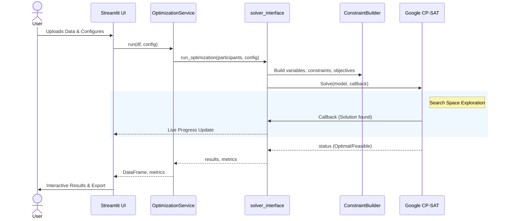
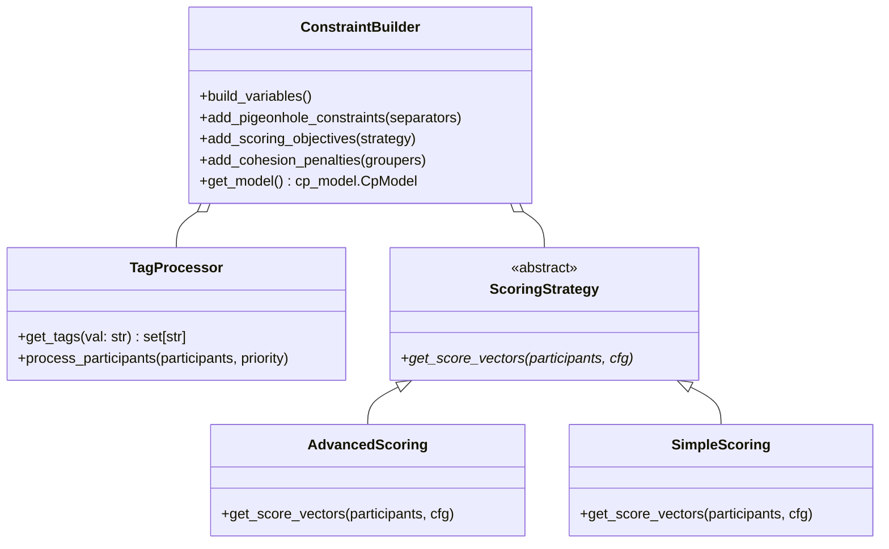

# ⚖️ Group Balancer V6

[](https://group-balancer.streamlit.app/)
[](LICENSE)
[](https://www.python.org/downloads/)

**Group Balancer** is an advanced mathematical partitioning tool designed to solve the "Fair Team" problem. Whether you are organizing a classroom, a corporate workshop, or a gaming tournament, this tool ensures your groups are balanced by skill, diverse by expertise, and respectful of social dynamics.

Built with **Streamlit** and powered by **Google OR-Tools (CP-SAT)**, it moves beyond random shuffling to provide high-quality mathematically optimized assignments.

---

## 🌟 V6 Advanced Engine: What's New?
The V6 engine introduces a sophisticated multi-objective optimization framework:
*   **Refactored Core:** Now uses professional **Builder** and **Strategy** patterns for model construction and scoring logic.
*   **Dynamic Schema:** Support for multiple score dimensions (`Score1`, `Score2`, etc.) with independent weighting.
*   **Tag-Based Logic:** Use character tags to force people apart (**Separators**) or keep them together (**Groupers**), with intelligent **Conflict Resolution**.
*   **UI Decoupling:** Business logic is now isolated in a dedicated **Service Layer**, allowing for better testability and independent evolution.
*   **Type Safety:** Comprehensive type hinting and Pydantic-like dataclasses for robust data handling.

---

## 🛡️ Security & Hardening
Group Balancer V6 is designed for enterprise-grade safety:
*   **Path Validation:** Strict normalization and `realpath` checks for all file inputs to prevent path traversal.
*   **Size & Scale Limits:** Hard caps on file size (10MB) and participant count (1000) to protect against DoS attacks.
*   **Numerical Safety:** Automated **Integer Overflow Protection** for CP-SAT objective functions, ensuring solver stability with extreme weights.
*   **Strict Sanitization:** Input data is coerced and sanitized before reaching the optimization core.

---

## 🚀 Getting Started

### For the Layman (Easy Way)
The easiest way to use Group Balancer is via the **Web Interface**.
1.  Visit the [Live App](https://group-balancer.streamlit.app/).
2.  Download the template or prepare your own Excel/CSV file.
3.  Upload, configure your groups, and click **Generate**.

### For the Technical User (Local Setup)
If you want to run it locally or contribute to the project:

**1. Prerequisites**
*   Python 3.10 or higher.
*   Git (to clone the repo).

**2. Installation**

#### Using uv (Recommended)
```bash
# Install dependencies and setup environment
uv sync
```

#### Using pip
```bash
# Setup virtual environment
python -m venv venv
source venv/bin/activate  # Windows: venv\Scripts\activate

# Install dependencies
pip install -r requirements.txt
```

**3. Launch the UI**
```bash
streamlit run app.py
```

---

## 📖 How to Use

### Step 1: Data Preparation
Your input file (Excel or CSV) should have a few key columns:
*   **Name:** The participant's identifier.
*   **Score1, Score2...:** Numeric values you want to balance (e.g., Skill, Age, Experience).
*   **Separators (Optional):** Character tags for people who should be in *different* groups.
*   **Groupers (Optional):** Character tags for people who should stay *together*.

> **💡 Pro Tip:** Every character in the Separator/Grouper cells is treated as a unique tag. Using `ABC` in a cell means that person belongs to three different constraint groups!

### Step 2: Configuration
*   **Group Count & Sizes:** Tell the solver exactly how many groups you need and how many people go in each.
*   **Weighting:** If `Score1` is twice as important as `Score2`, set the weights to `2.0` and `1.0` respectively.
*   **Topology:** Use **Simple** for lightning-fast results on large datasets, or **Advanced** for deep multi-dimensional balancing.

### Step 3: Review & Tweak
Once generated, you can:
*   **Visualize:** See group cards with average scores and totals.
*   **Live Edit:** Manually move a person to a different group; the stats will update in real-time to show you the impact on balance.
*   **Export:** Download your finalized grouping as a polished Excel file.

---

## 🧩 How It Works: The "Magic" Behind the Scenes

### The Layman's Explanation
Imagine you have 20 people and you want to split them into 4 fair teams. A human might try to pick captains and then take turns, but they often miss the "big picture." 

The solver looks at **millions of possible combinations** in seconds. It treats the problem like a giant puzzle where it tries to:
1.  Keep the team averages as close to each other as possible.
2.  Make sure the "Experts" are spread out so no team is overpowered.
3.  Try to keep "Friends" together without breaking the first two rules.

### The Technical Explanation (CP-SAT)
The V6 Engine models the partition as a **Constraint Programming** problem:

1.  **Decision Variables:** A binary matrix $x_{i,g} \in \{0, 1\}$ where $1$ indicates participant $i$ is in group $g$.
2.  **Hard Constraints (Non-Negotiable):**
    *   **Assignment:** $\sum_{g} x_{i,g} = 1 \quad \forall i$ (Everyone in exactly one group).
    *   **Capacity:** $\sum_{i} x_{i,g} = C_g \quad \forall g$ (Group sizes must match user input).
    *   **Pigeonhole Separators:** For any tag $T$, $\sum_{i \in T} x_{i,g} \le \lceil |T| / N \rceil$. This ensures an even spread of specific attributes.
3.  **Soft Constraints & Objectives:**
    *   **Score Balance:** Minimizes $\sum_{col} w_{col} \sum_{g} | \text{ActualSum}_{g,col} - \text{TargetSum}_{g,col} |$.
    *   **Cohesion (Groupers):** Adds a penalty to the objective function for every unique group a "Grouper" tag is spread across. This encourages the solver to "pack" these individuals together.


```mermaid
sequenceDiagram
    actor User
    participant UI as Streamlit UI
    participant Service as OptimizationService
    participant Interface as solver_interface
    participant Builder as ConstraintBuilder
    participant SAT as Google CP-SAT

    User->>UI: Uploads Data & Configures
    UI->>Service: run(df, config)
    Service->>Interface: run_optimization(participants, config)
    Interface->>Builder: Build variables, constraints, objectives
    Interface->>SAT: Solve(model, callback)
    
    rect rgb(240, 248, 255)
    note right of SAT: Search Space Exploration
    SAT->>Interface: Callback (Solution found)
    Interface-->>UI: Live Progress Update
    end

    SAT-->>Interface: status (Optimal/Feasible)
    Interface-->>Service: results, metrics
    Service-->>UI: DataFrame, metrics
    UI->>User: Interactive Results & Export
```

---

### 🏗️ Architecture: Professional Patterns
The V6 engine is built for extensibility and clarity, utilizing industry-standard design patterns.


```mermaid
classDiagram
    class TagProcessor {
        +get_tags(val: str) set[str]
        +process_participants(participants, priority)
    }
    class ScoringStrategy {
        <<abstract>>
        +get_score_vectors(participants, cfg)*
    }
    class AdvancedScoring {
        +get_score_vectors(participants, cfg)
    }
    class SimpleScoring {
        +get_score_vectors(participants, cfg)
    }
    class ConstraintBuilder {
        +build_variables()
        +add_pigeonhole_constraints(separators)
        +add_scoring_objectives(strategy)
        +add_cohesion_penalties(groupers)
        +get_model() cp_model.CpModel
    }
    
    ScoringStrategy <|-- AdvancedScoring
    ScoringStrategy <|-- SimpleScoring
    ConstraintBuilder o-- ScoringStrategy
    ConstraintBuilder o-- TagProcessor
```

---

## 📂 Project Structure

<!-- PROJECT_TREE_START -->
```text
.
├── .coderabbit.yaml
├── .github/
│   ├── dependabot.yml
│   └── workflows/
│       └── ci.yml
├── .gitignore
├── CHANGELOG.md
├── LICENSE
├── README.md
├── app.py
├── build.py
├── group_balancer.py
├── pyproject.toml
├── requirements-dev.in
├── requirements-dev.txt
├── requirements.in
├── requirements.txt
├── src/
│   ├── __init__.py
│   ├── core/
│   │   ├── __init__.py
│   │   ├── config.py
│   │   ├── data_loader.py
│   │   ├── models.py
│   │   ├── services.py
│   │   ├── solver.py
│   │   └── solver_interface.py
│   ├── ui/
│   │   ├── __init__.py
│   │   ├── components.py
│   │   ├── results_renderer.py
│   │   ├── session_manager.py
│   │   └── steps.py
│   └── utils/
│       ├── __init__.py
│       ├── exporter.py
│       └── group_helpers.py
├── tests/
│   ├── __init__.py
│   ├── test_config.py
│   ├── test_coverage_edge_cases.py
│   ├── test_data_loader.py
│   ├── test_edge_cases.py
│   ├── test_exporter.py
│   ├── test_infra.py
│   ├── test_models_unit.py
│   ├── test_services.py
│   ├── test_solver.py
│   ├── test_solver_interface.py
│   ├── test_solver_unit.py
│   ├── test_ui.py
│   └── test_utils.py
└── tools/
    ├── __init__.py
    └── update_readme.py
```
<!-- PROJECT_TREE_END -->

---

## 🛡️ Data Privacy & Security

*   **100% Stateless:** No data is stored on our servers. Files exist only in temporary RAM during your session.
*   **Privacy by Design:** We do not use databases or tracking cookies.
*   **Local-First:** If you run the tool locally, no data ever leaves your machine.

---

## 🛠 Configuration
Developer-level constants can be adjusted in `src/core/config.py`:
- `SCALE_FACTOR`: Precision for float-to-integer conversion.
- `SOLVER_TIMEOUT`: Global hard-cap for search time.
- `COL_NAME / COL_GROUPER / COL_SEPARATOR`: Change the expected column headers to match your existing data pipeline.
